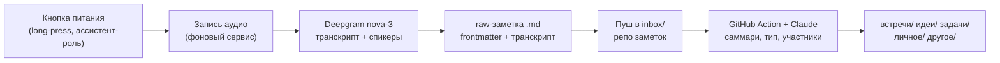

# MyNoteBook

Личный Android-диктофон в духе Plaud Note: **долгое нажатие кнопки питания — старт записи,
ещё одно — стоп**. Дальше всё само: расшифровка, Markdown-заметка, пуш в приватный
GitHub-репо, где Claude дописывает саммари и раскладывает по папкам. От «стопа» до готовой
заметки — ни одного действия.

Один пользователь, один телефон (OnePlus 13, OxygenOS 15), sideload без Play Store.

## Как это работает



- Запись стартует с заблокированного экрана — приложение держит системную роль
  «цифровой ассистент».
- Аудио живёт только на телефоне, в git не попадает.
- Нет сети — заметка ждёт в очереди и уходит сама.
- Приложение — «пульт и журнал»: статус пайплайна, транскрипт, плеер, повтор при ошибке.
  Читаются заметки в GitHub.

## Установка и настройка

Мануал с нуля — **[docs/SETUP.md](docs/SETUP.md)**: APK из
[Releases](../../releases), онбординг-чеклист, токены GitHub/Deepgram, workflow
Claude-Action в репо заметок.

## Стек

Kotlin + Jetpack Compose (minSdk 34, targetSdk 35) · WorkManager (очередь пайплайна) ·
Deepgram nova-3 с диаризацией (STT) · `anthropics/claude-code-action` (саммари).

## Структура репо

| Путь | Что |
|---|---|
| `app/` | Приложение (единственный Gradle-модуль) |
| `PRODUCT.md` | Продуктовая правда: сценарий, принципы, ограничения |
| `docs/SPEC.md` | Спека v1 целиком |
| `CONTEXT.md` | Глоссарий терминов (Запись, Заметка, Кнопка, Пайплайн…) |
| `docs/specs/` | Спеки: формат заметки и контракт Action, проба кнопки питания |
| `docs/adr/` | Архитектурные решения (ADR-гейт — см. `CLAUDE.md`) |
| `docs/SETUP.md` | Мануал по настройке |

## Сборка

```bash
export JAVA_HOME=<путь к JDK 17>
echo "sdk.dir=<путь к Android SDK>" > local.properties   # файл в gitignore, на свежем клоне его нет
./gradlew ktfmtCheck detekt lint testDebugUnitTest assembleDebug   # верификация
./gradlew assembleRelease                                          # релизный APK
```

Формат — ktfmt, статанализ — detekt + Android Lint; всё обязано быть зелёным до «готово»
(правила для агентов — `CLAUDE.md`).
